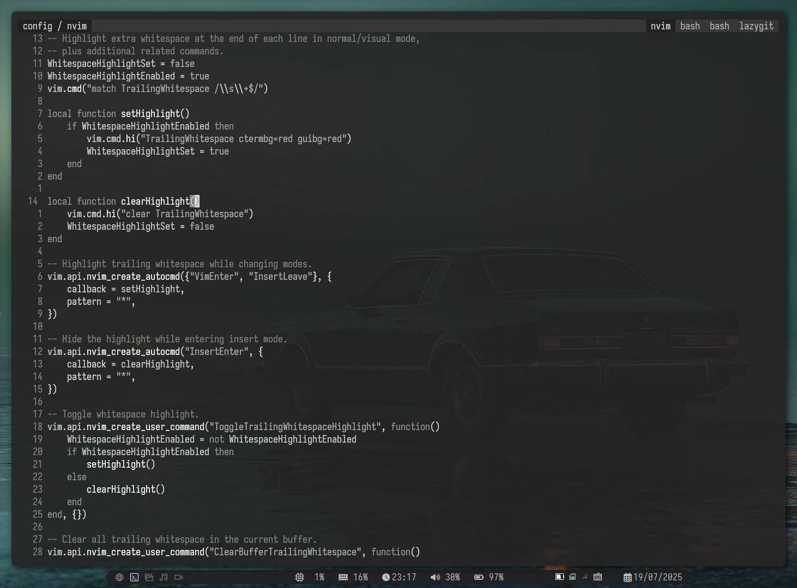

# Linux dotfiles

Dotfiles for different tools while working under Linux, including:

- i3.
- Tmux.
- Neovim.
- Lazygit.
- Keyd, etc.

Plus aliases and personal scripts.

To load the bash options, add the following at the end of `.bashrc`:

    if [ -f ~/.config/.bash_options ]; then
        . ~/.config/.bash_options
    fi

To load the `keyd` config, the file must be symlinked to `/etc/keyd/`, which is the actual location where the file is read by the daemon:

    sudo ln -s ~/.config/keyd/default.conf /etc/keyd/default.conf
